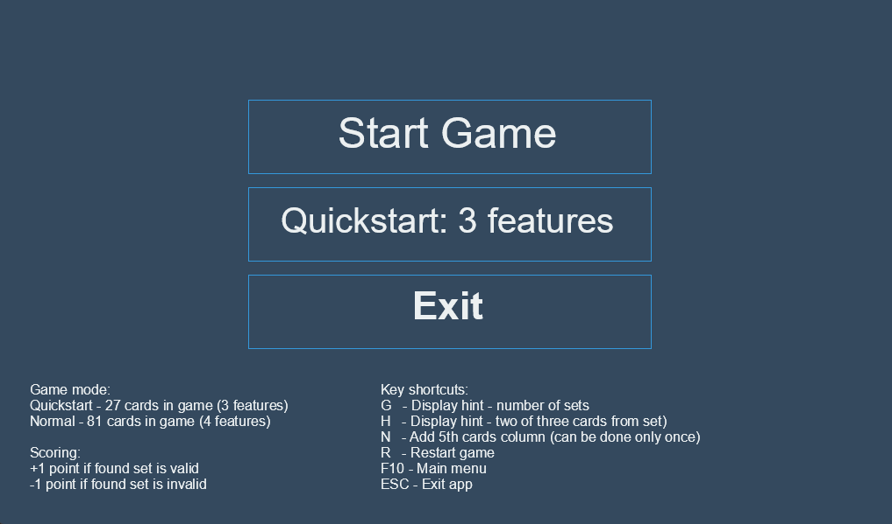
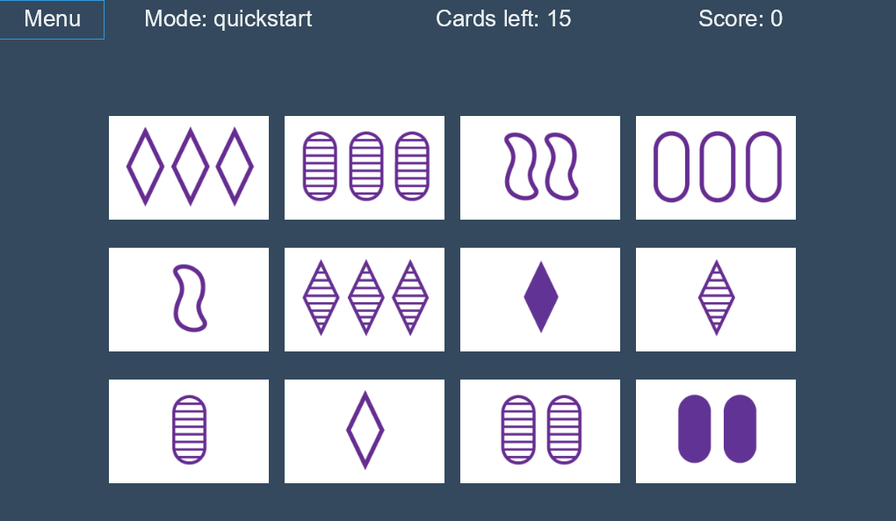
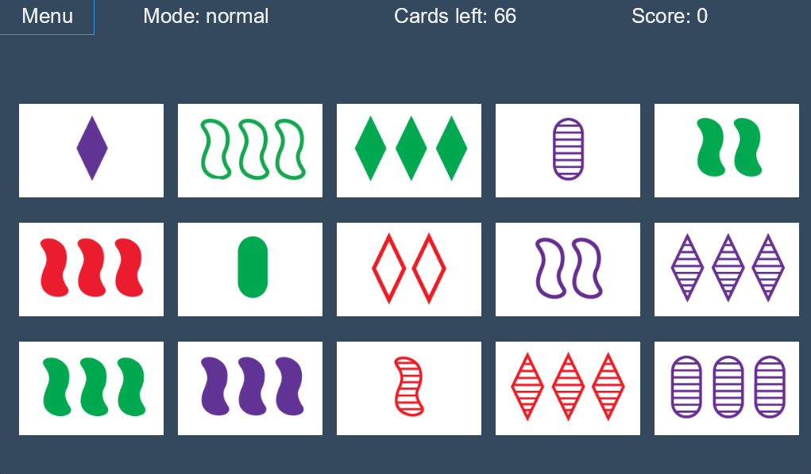
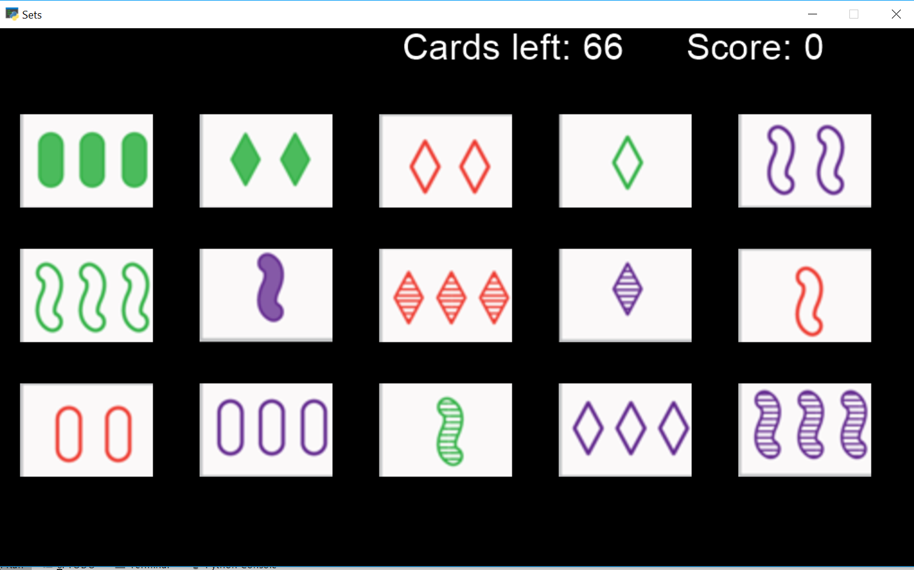

# sets-game
Sets game written in Python using pyglet library

### Game mechanic description

The deck consists of 81 cards varying in four features: 
* color: red, purple, green
* number: one, two, three
* shape: diamond, squiggle, oval
* pattern: solid, striped, outlined

Each possible combination of features (e.g., a card with three striped green diamonds) appears precisely once in the deck.

A set consists of three cards satisfying all of these conditions:
* They all have the same number or have three different numbers.
* They all have the same symbol or have three different symbols.
* They all have the same shading or have three different shadings.
* They all have the same color or have three different colors.

In the beginning of game player see 12 cards. Goal is to find all sets. 
If there are no any sets visible, player can request three more cards, 
with total of 15.

Scoring: +3 point to set found, -1 for wrong set clicked.

### Python implementation  

At current state game is finished and playable.

**Features**

* [x] Display number of cards left in unused deck 
* [x] Replace old cards with fresh from unused deck when user finds correct set
* [x] Display menu in the beginning with features choice option (quickstart and complete option)
* [x] Add penalty for clicking wrong cards that will decrease score
* [x] Display end game screen
* [x] Implement Finite State Machine for three game states (menu, game, end) and transitions between them
* [x] Hints: Add H key to automatically show two out of three cards from random set
* [x] Add restart capability
    * Return to game
    * Return to menu
* [x] Draw additional fifth column at player request
* [x] Added second graphics to the game, old graphics can be chosen by running with --old-graphic parameter


*Game Menu*



*Quickstart Mode*



*Normal Mode with 5th column*



*Normal Mode with 5th column - New Graphics*



---

### Build exe in Windows

```
pip install pyinstaller
pyinstaller -cF run_game.spec
```


---

Reference:

* [Wikipedia - Set (card game)](https://en.wikipedia.org/wiki/Set_(card_game))
